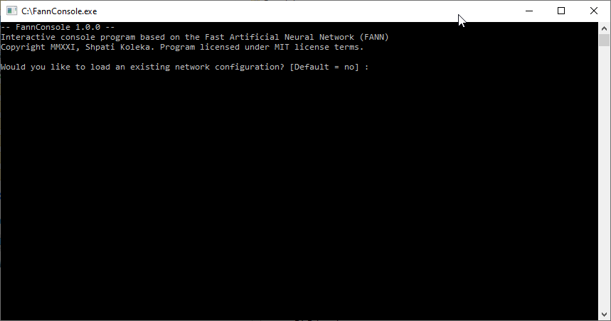

# FannConsole
FannConsole is a small interactive console program used for creating, training and testing artificial neural networks (ANN).
The program is based on the Fast Artificial Neural Network (FANN) library and runs on Windows. 

Some of the program features are:

-	Create Artificial Neural Networks interactively based on user input.
-	Train the Artificial Neural Networks using user defined parameters (using the sigmoid activation function). 
-	Test the trained networks using a test data file or via user input provided interactively. 
-	Ability to save/load the trained Artificial Neural Network to/from a file. 
-	It's a free program (MIT license) so you can do whatever you want with the code. 

Please keep the fannfloat.dll file in the same directory as the FannConsole program.  